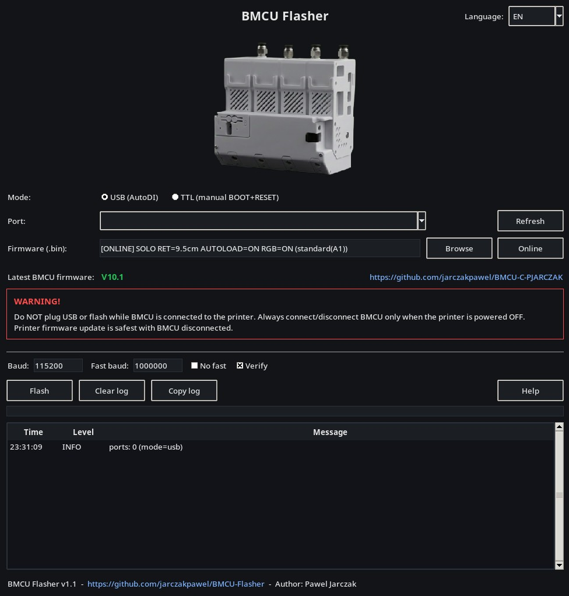

# BMCU Flasher

Cross-platform flasher for BMCU (WCH ISP protocol).



- OS: Linux / Windows / macOS
- Modes:
  - USB (BMCU with CH340 on board, AutoDI)
  - TTL (pin header / external USB-Serial, manual BOOT+RESET)

## Download
Download prebuilt binaries from Releases:
- Windows: BMCU-Flasher-windows-x64.zip
- macOS: BMCU-Flasher-macos.zip
- Linux: BMCU-Flasher-linux-x64.tar.gz

## Firmware
Latest BMCU firmware:
https://github.com/jarczakpawel/BMCU-C-PJARCZAK

GUI has "Online" firmware selection (no manual searching/downloading):
- choose mode (Standard / High force)
- choose slot (SOLO / AMS_A / AMS_B / AMS_C / AMS_D)
- choose retract length, AUTOLOAD, RGB
- the app downloads the selected firmware and flashes it

## Drivers (CH340)
In USB mode (CH340), drivers may be required on Windows.
Linux and macOS usually work out-of-the-box.

## Usage
GUI:
- Use the app and click "Help" inside the program.

CLI (optional):
- USB (auto port by VID/PID):
```bash
  python3 bmcu_flasher.py firmware.bin --mode usb
```
- TTL (manual BOOT+RESET, port required):
```bash
  python3 bmcu_flasher.py firmware.bin --mode ttl --port /dev/ttyUSB0
```

## License
MIT - see LICENSE.
